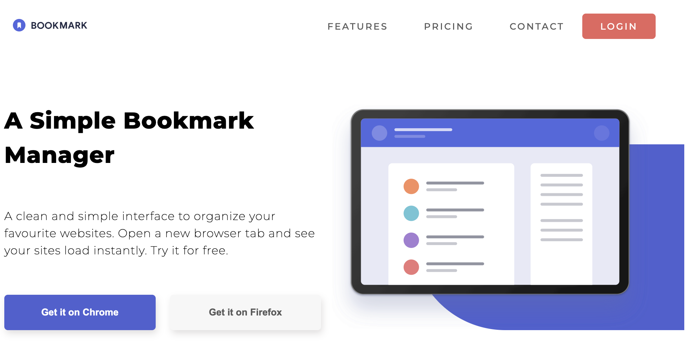

# Responsive Landing Page

## 📄 Description

This project is a **responsive landing page** built to practice HTML and CSS layout and styling by cloning an existing design.

## 💻 Technologies Used

- HTML5  
- CSS3

## 📸 Preview



## 📋 Requirements

To view this project you only need a modern web browser (such as Chrome, Firefox, or Edge).  
No server or dependency installation is required.

## 🛠️ Installation

1. Clone this repository:  
   ```bash
   git clone https://github.com/Jperaire/responsive-landing-page.git
```

2. Navigate to the project directory:

   ```bash
   cd responsive-landing-page
   ```

## ▶️ Usage

Open the `index.html` file directly in your browser to view the page.

Optionally, if you have **Live Server** installed in Visual Studio Code, you can right-click on `index.html` and select **"Open with Live Server"** to see the page with live reloading.


